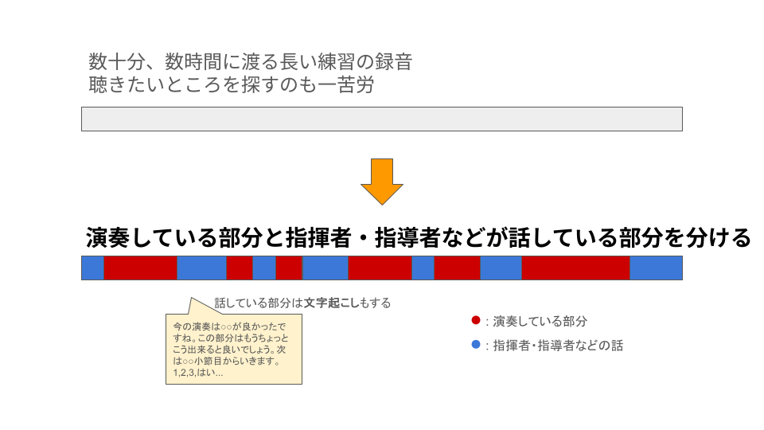
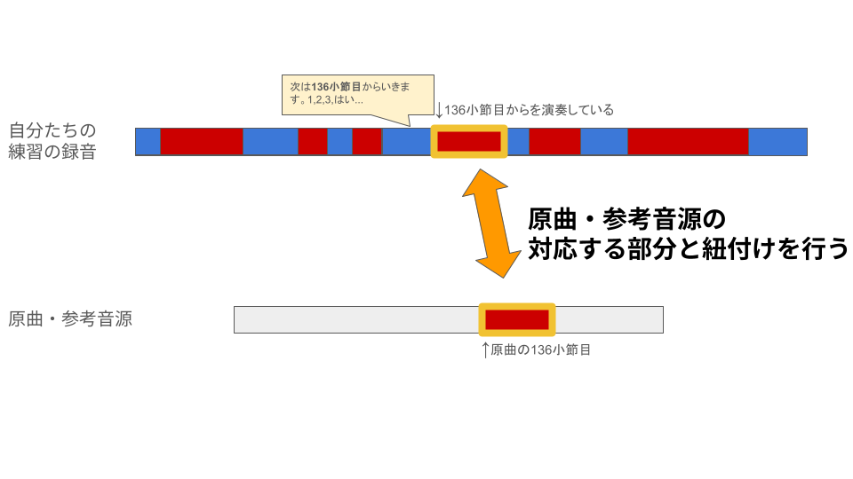
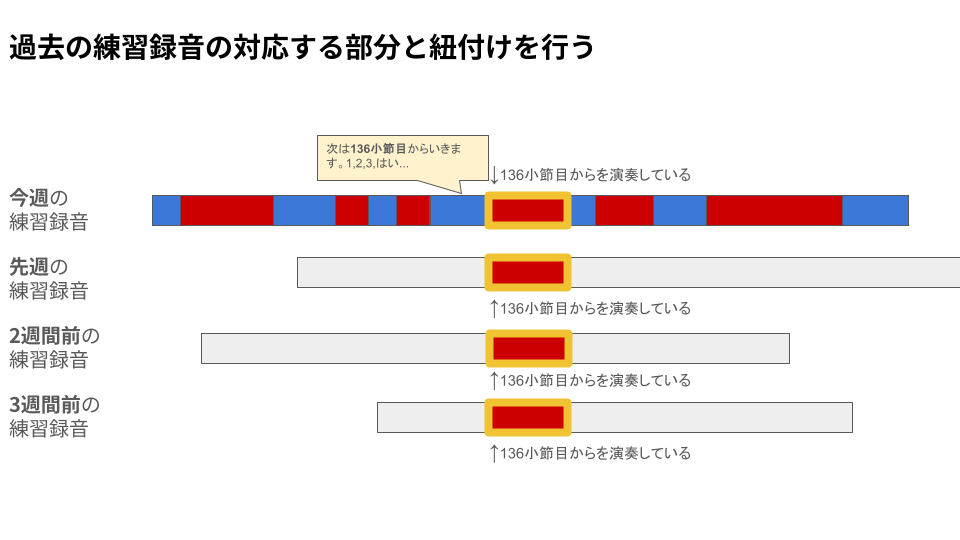
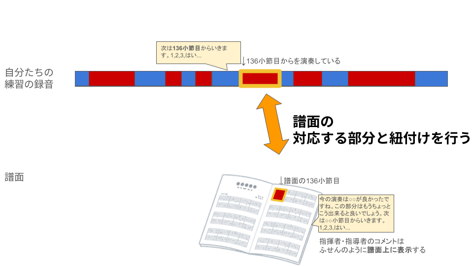

# segnote
Maximizing the value of rehearsal recordings for orchestras, choirs, wind bands, and musical groups. / オーケストラや合唱団、吹奏楽部、バンドなどの合奏録音の価値を最大化する 

# 実現したいこと

## Phase1. 演奏している部分と指揮者・指導者などが話している部分を分ける

- 数十分、数時間に渡る長い練習の録音は聴きたいところを探すのも一苦労
- 演奏している部分と指揮者・指導者などが話している部分を分けることで聴きたいところを探しやすくする
- 指揮者・指導者が話している部分は文字起こしもすることで検索などもできるように

## Phase2. 原曲・参考音源の対応する部分と紐付けを行う  過去の練習録音の対応する部分と紐付けを行う

- 自分たちの練習録音の演奏部分のそれぞれに対して原曲・参考音源の対応する部分と紐付けを行う

- 原曲・参考音源との対応をキーにすれば、過去の練習録音の対応する部分とも紐付けを行うことができるだろう

## Phase3. 譜面の対応する部分と紐付けを行う

- さらに、譜面の対応する部分と紐付けを行うことができれば、毎回の録音を起点にするのではなく、譜面を起点に過去の録音を辿れるようになる
- 譜面OCRは難しそう

# 名前について

segno(イタリア語,セーニョ,印の意)

segment(長い録音をsegmentation)

+ note(音符,注釈,記録)

